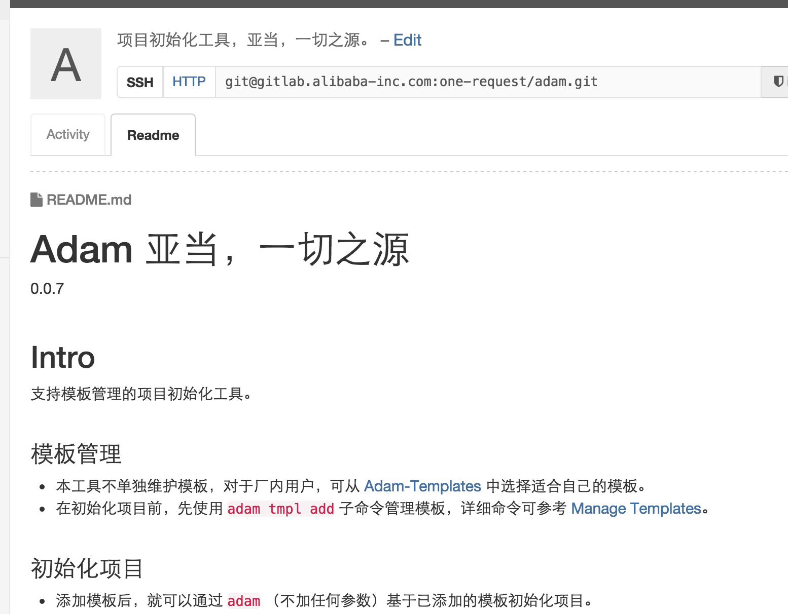
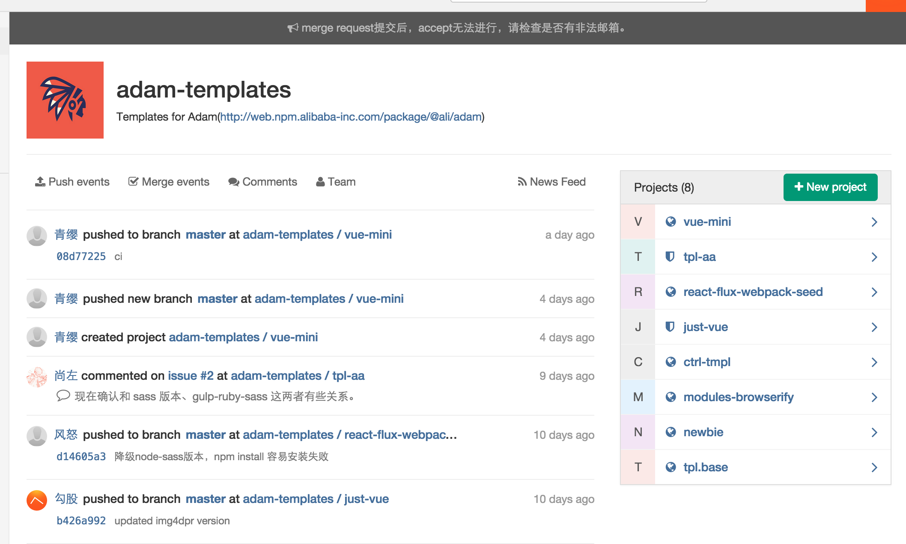

# Conventions

----

## Conventions

> We need same coding style! same tools! same editor ...

----

## Follow the Edge

> I want to try React.js, CSS Next ...

----

## So the Problem is

How to follow conventions and new technologies at the same time?

----

## But Actually

First, following the same conventions in a group is not necessary, but be in a repo.

----

## But Actually

Second, many projects dies very fast.

----

## Our Strategy

- *No* forced team conventions
- Build a *generator marketplace*

----

## "Adam"

----

## "Adam"

----

## "Adam": Intro

- a simple project generator cli
- and adam marketplace service
- easily find, use, create and fork generators with git repos

----

## "Adam": Rules

Every person could create its own generator and influence more people to use.

----

## "Adam": Benefits

- The edge parts could be imported easily.
- And the good parts will be applied much.

----

## "Adam": Reality

You must have ability to work fine with all kinds of popular tools, coding styles, frameworks, solutions ... now.

----

## tips

## **Find the keypoint clearly and always keep walking fast!**
