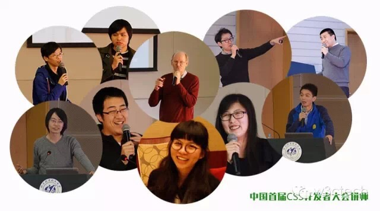
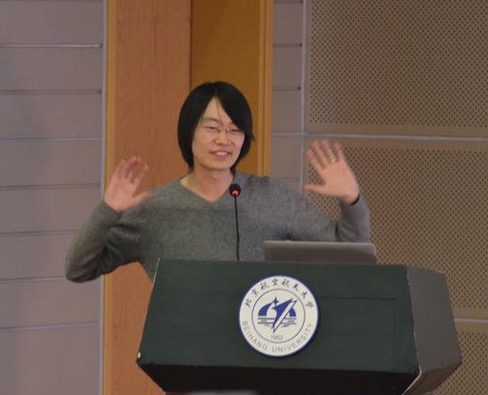
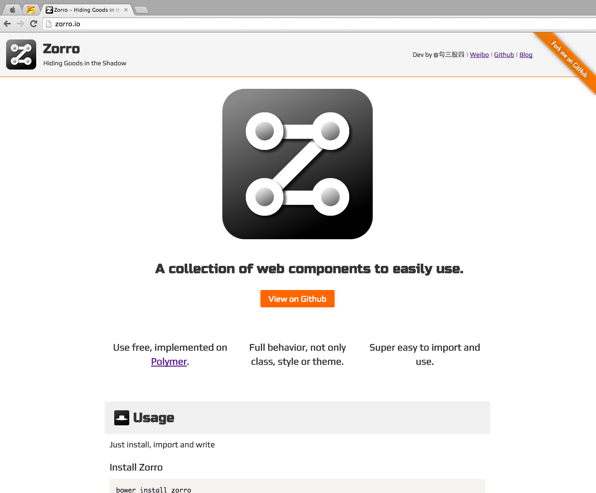

# {My CSS Conf 1}

----

## 2015-01-10 Beijing

----

## A Lighting Talk

It's really light but...

----

## A Lighting Talk

----

## A Lighting Talk

----

## Resources

- [CSS Scoping in Web Components](http://jiongks.name/slides/css-scoping/)
- screencast: [lighting talk](http://www.tudou.com/programs/view/8bvwGHaL6T4/)
- screencast: [more details](http://www.tudou.com/programs/view/dz4aXjDFnLw/)

----

## http://zorro.io

----

## That's the Future

----

## But ... Reality

