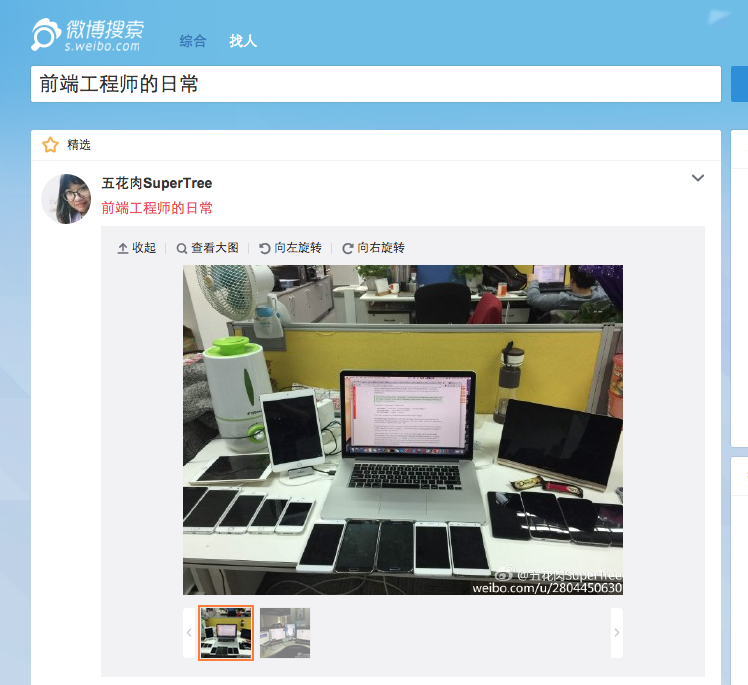
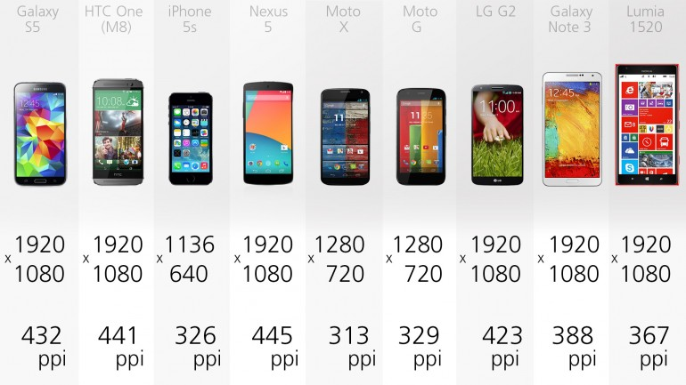
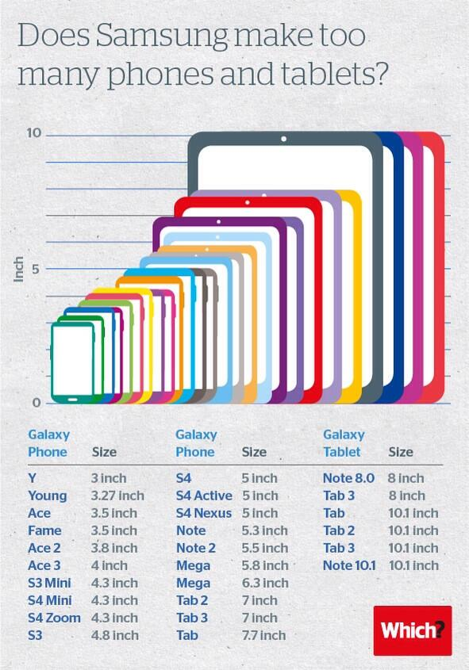
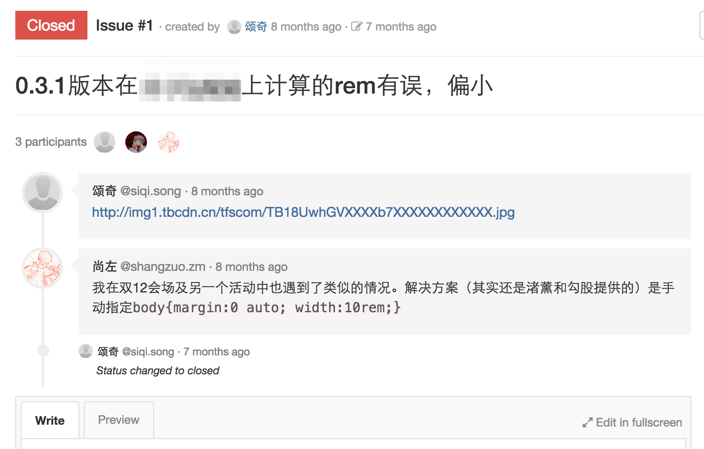
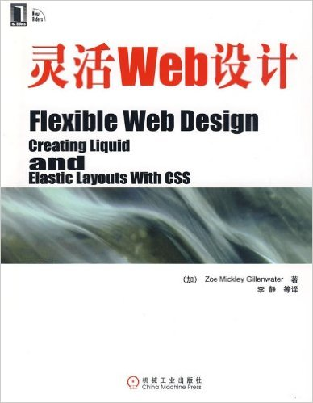
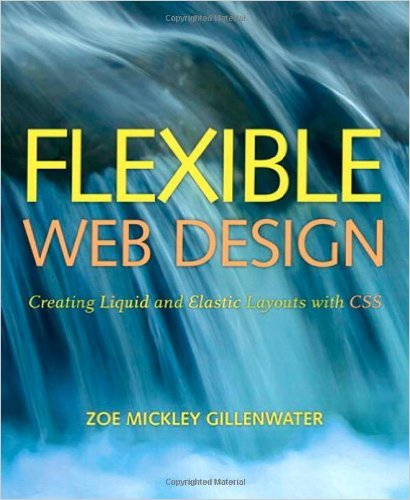
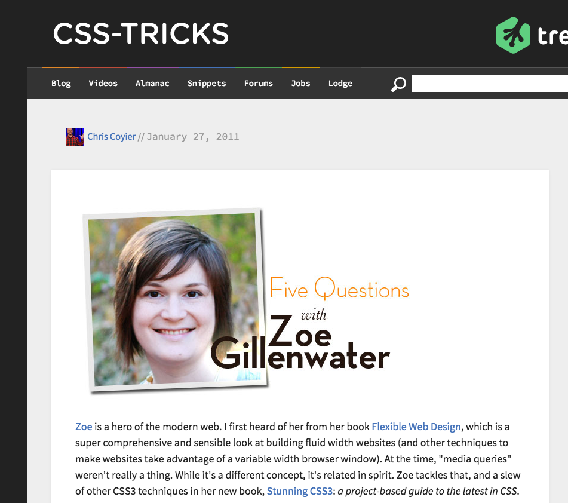
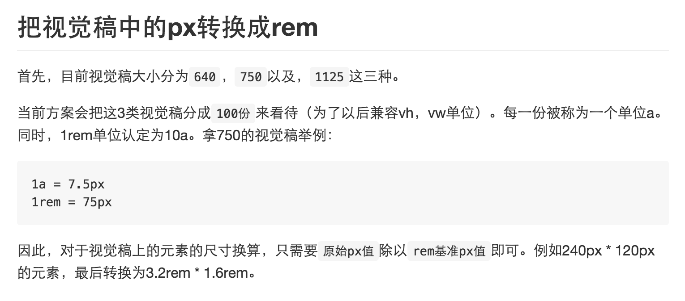

# Screens

----

## DailyFrontEnd

----

## DailyFrontEnd

----

## DailyFrontEnd

----

### DailyFrontEnd

----

## All Kinds of Devices

- different size
- different DPR
- "surprised" devices

----

## Flexible Web Design

----

## Flexible Web Design

----

## Flexible Web Design

----

## Flexible Web Design

> 现在,拿起你手中正在阅读的这本书,调整它的大小,以便更易于阅读。

----

## tips

## **Break by-self**

----

## lib.flexible

----

## lib.flexible

1: assume device width is fixed

- just one width-fixed PSD file
- length unit = `<width>` / `10rem`

----

## lib.flexible

----

## lib.flexible

2: if you want to show more in larger screen

- dpr related length
- e.g. font size *= dpr

[github](https://github.com/amfe/lib-flexible)
