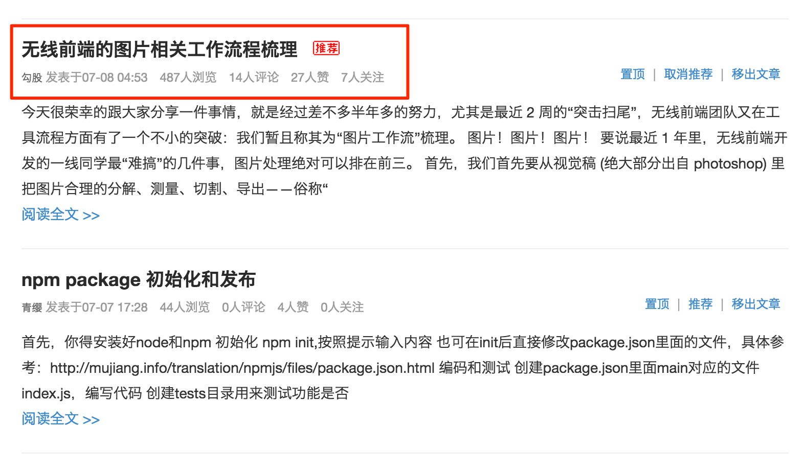
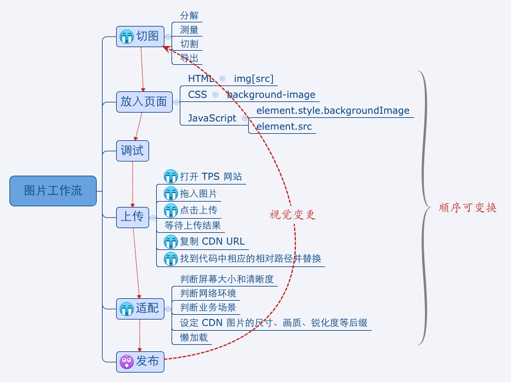
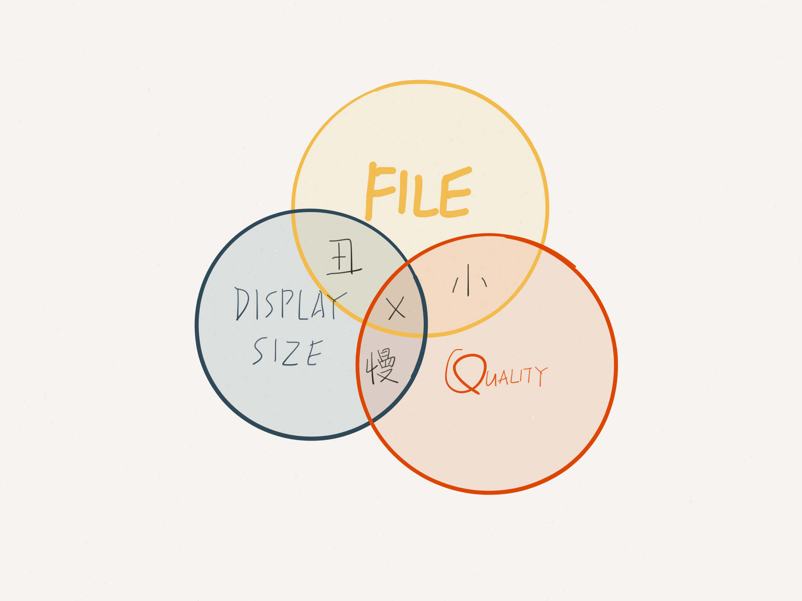
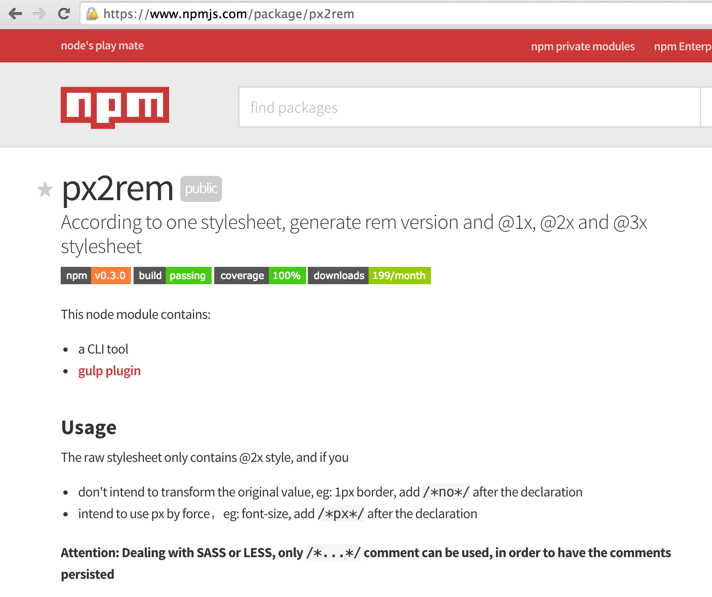
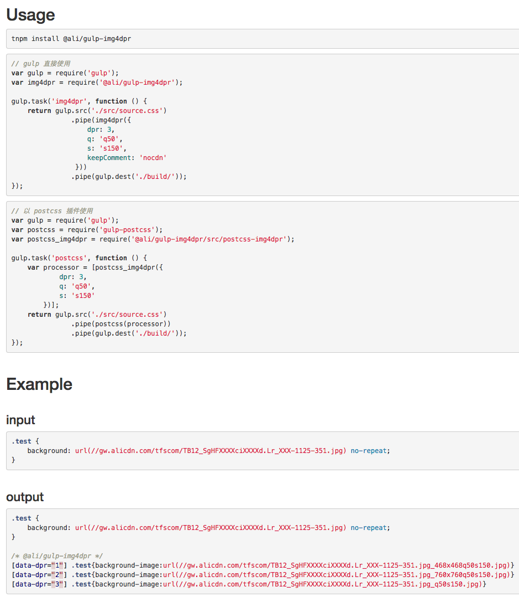
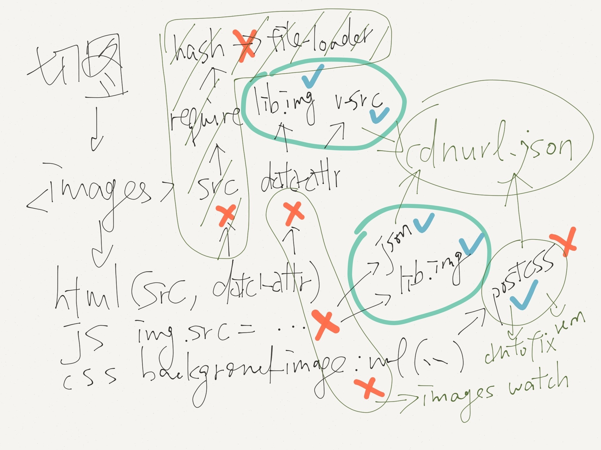
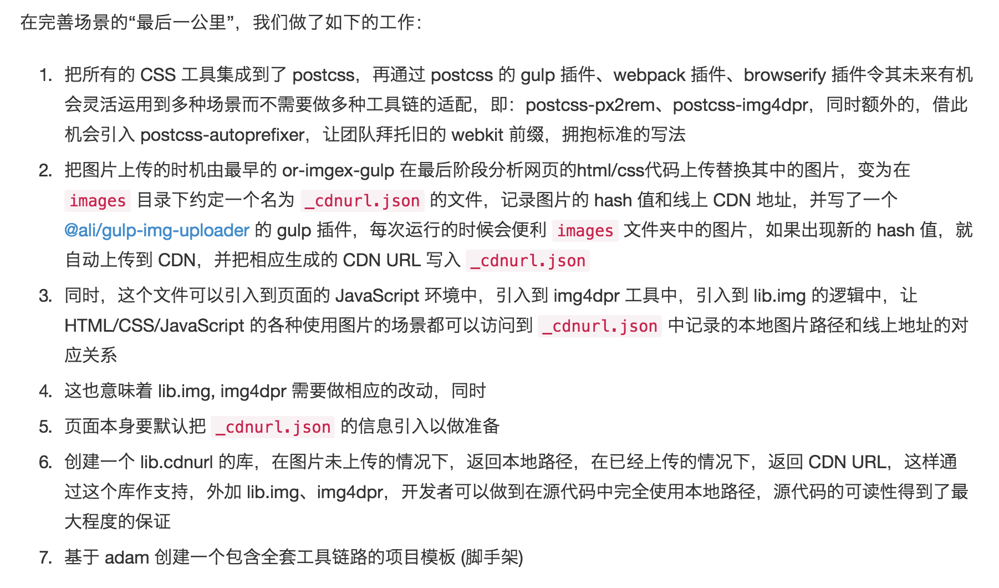
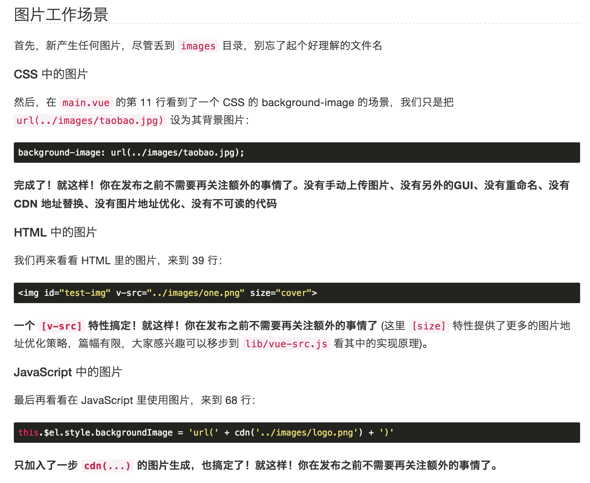

# Images

----

## Workflow

----

## Workflow

----

## Workflow

- crop from `*.psd` file
- export to images folder
- write html/css/javascript code
  - adjust image size and quality
- deploy (upload)
  - separate images from code

----

## Three Matters

- file size
- display size
- (quality)

----

## Three Matters

----

## Our Improvement

We make lots of efforts on it

----

## Our Improvement

searching for Photoshop plugins

----

## Our Improvement

Image CDN: custom size and quality by url suffix

----

## Our Improvement

`lib.img`: automatically get the url

----

## Our Improvement

----

## Our Improvement

`px2rem`: parse `*px` to `*rem`

[npm](https://www.npmjs.com/package/px2rem)

----

## Our Improvement

----

## Our Improvement

`gulp-img4dpr`: separate bg image url for each dpr

(will be open-sourced soon)

----

## The Problem

## But It's not cool...

----

## The Problem

## as all above *fragmented*

----

## The Better Solution

We put them together finally

----

## The Better Solution

----

## The Better Solution

----

## The Better Solution

