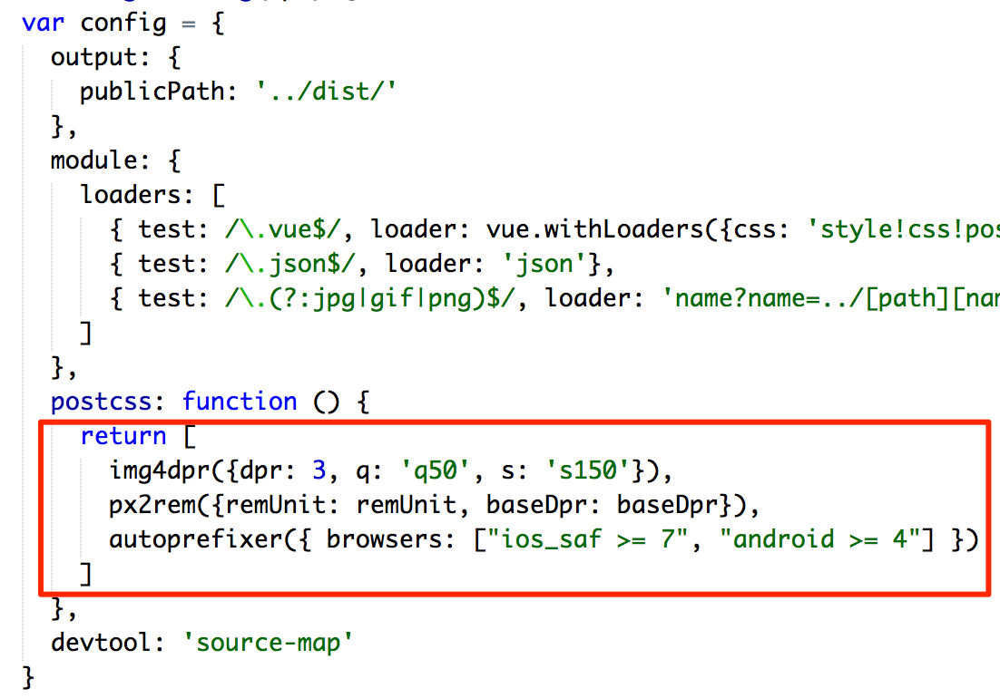

# Yes We Use PostCSS

----

## Easy to Collect

----

## Easy to Integrate

- gulp
- grunt
- webpack
- ...

----

## tips

## **Just focus on the Scenes, not a single feature.**

----

## tips

## **Find a good platform which can transfer you to everywhere.**
