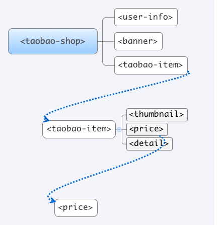

# 新的 CSS 用法

----

## 样式表结构

* 元素可能包含 shadow
* 元素可能在另一个 shadow 内
* 元素可能包含子元素
* 子元素可能受 shadow 影响

----

----

----

## 建立联系

* 外部结构
* 内部结构
* 子元素

----

## 举个例子

`<cssconf-speaker>`  
[homepage](http://css.w3ctech.com/)

----

## `<cssconf-speaker>`

----

判断外部环境

----

## :host

> `:host {display: block}`

[code](view-source:http://jinjiang.github.io/webcomponents-demo/css-scoping/speaker.html) [demo](http://jinjiang.github.io/webcomponents-demo/css-scoping/speaker.html)

----

## :host(<selector>)

> `:host(:hover) {...}`

[code](view-source:http://jinjiang.github.io/webcomponents-demo/css-scoping/speaker-1.html) [demo](http://jinjiang.github.io/webcomponents-demo/css-scoping/speaker-1.html)

----

## :host(<selector>)

> `:host([gender="female"]) {...}`

[code](view-source:http://jinjiang.github.io/webcomponents-demo/css-scoping/speaker-2.html) [demo](http://jinjiang.github.io/webcomponents-demo/css-scoping/speaker-2.html)

----

## :host-context(<selector>)

> `:host-context(fieldset[disabled]) btn {...}`

----

## :host-context(<selector>)

> `:host-context(body[env="phone"]) {...}`

[code](view-source:http://jinjiang.github.io/webcomponents-demo/css-scoping/speaker-3.html) [demo](http://jinjiang.github.io/webcomponents-demo/css-scoping/speaker-3.html)

----

## 判断外部环境

* `:host`
* `:host(<selector>)`
* `:host-context(<selector>)`

----

判断内部结构

----

## ::shadow

> `cssconf-speaker::shadow .inner {...}`

[code](view-source:http://jinjiang.github.io/webcomponents-demo/css-scoping/speaker-4.html) [demo](http://jinjiang.github.io/webcomponents-demo/css-scoping/speaker-4.html)

----

## ::shadow

> `photo::shadow .inner {...}`

[code](view-source:http://jinjiang.github.io/webcomponents-demo/css-scoping/speaker-5.html) [demo](http://jinjiang.github.io/webcomponents-demo/css-scoping/speaker-5.html)

----

## /deep/

> `html /deep/ [layout][vertical] {...}`

[code](view-source:http://jinjiang.github.io/webcomponents-demo/css-scoping/speaker-6.html) [demo](http://jinjiang.github.io/webcomponents-demo/css-scoping/speaker-6.html)

----

## 判断内部结构

* `::shadow`
* `/deep/`

----

内部判断子元素

----

## ::content

> `::content .avatar {...}`

[code](view-source:http://jinjiang.github.io/webcomponents-demo/css-scoping/speaker-7.html) [demo](http://jinjiang.github.io/webcomponents-demo/css-scoping/speaker-7.html)

----

## 总结

* `:host`, `:host(<selector>)`
* `:host-context(<selector>)`
* `::shadow`, `/deep/`
* `::content`

----

## 更多资料

* [W3C CSS Scoping Spec](http://www.w3.org/TR/css-scoping-1/#shadow-dom)

