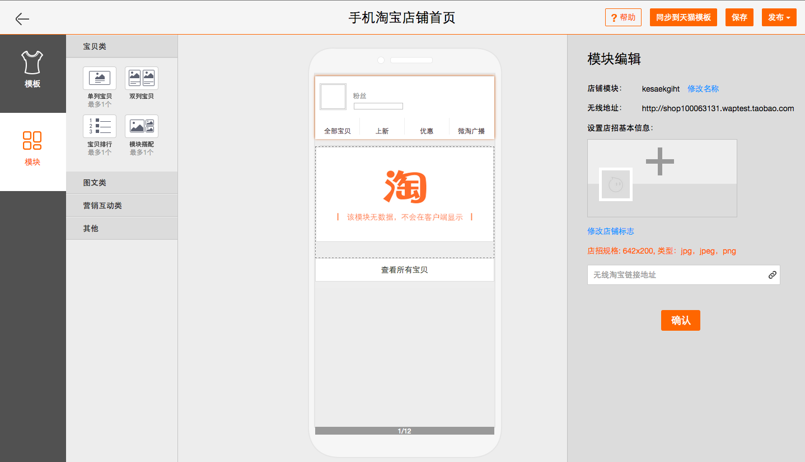

# 淘宝的实践

----

* 后台管理界面
  * 交互复杂
  * 逻辑性较强
  * 兼容性要求较低
* 基于 [Polymer](http://docs.polymerchina.org/)

----

替代之前大量使用的 Bootstrap

----

## 组件化的优势

* 代码量更小
* 对交互和数据友好
* 易于分工和维护

----

## 卖家装修后台

----

## Zorro.html

----

## Zorro.html

内部管理界面的组件库  
*未来有开源计划*
