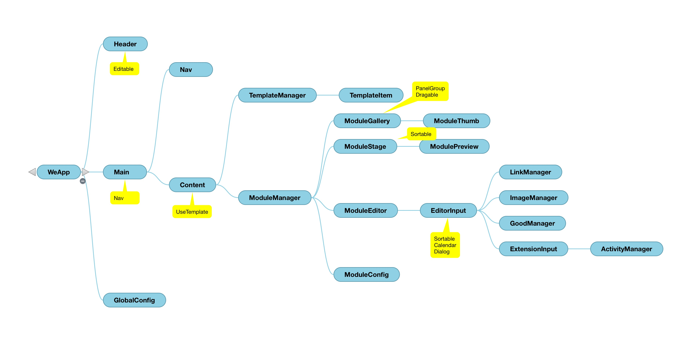

# webcomponents

----

这是什么？

----

## webcomponents

* 组件化开发
* 自定义标签
* 隐藏内部结构

----

## 组件化开发

----

## 自定义标签

> `<google-map></google-map>`

----

## 隐藏内部结构

----

## Shadow DOM

> `<custom-element>`  
> `　<!-- shadow-root -->`  
> `　　`  
> `　　<!-- 内部结构 -->`  
> `　<!-- /shadow-root -->`  
> `</custom-element>`

----

## Shadow DOM

* 为元素建立 `shadow root`，内部样式与外部样式表相隔离
* 没有外界干扰，没有额外的代码，像原生标签一样

----

## 典型的组件定义

> `<new-tag>`  
> `　生命周期、交互行为、自定义事件`  
> `　<!-- shadow -->`  
> `　　内部结构、内部样式`  
> `　<!-- /shadow -->`  
> `　子元素`  
> `</new-tag>`

----

## 回头想想HTML5

* `<header>`, `<footer>`, ...  
* `<audio>`, `<video>`  
* `
`, `
`
* 都可以这样创建

----

我们不再需要规范新的标签了

----

## 想象一下……

> `<calendar date="2015-01-10"></calendar>`  
> `<pagination value="3/10"></pagination>`  
> `<login-box></login-box>`

----

## 想象一下……

> `<iphone>...</iphone>`  
> `<weibo>...</weibo>`  
> `<slider>...</slider>`

----

## 实例

----

庖丁解牛

美好前端的未来!

----

## 更多资料

* [W3C Spec](http://w3c-html-ig-zh.github.io/webcomponents/)
* [webcomponents.org](http://webcomponents.org/)
* [Polymer](http://docs.polymerchina.org/)
* [Screencast](http://www.tudou.com/plcover/r0pA0z77CgM/)

