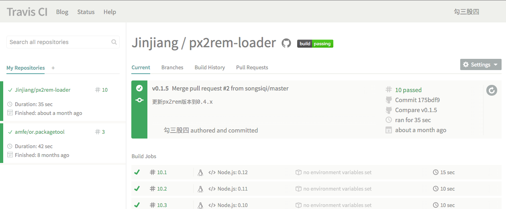
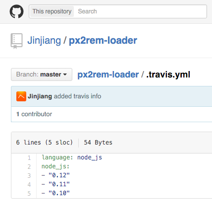
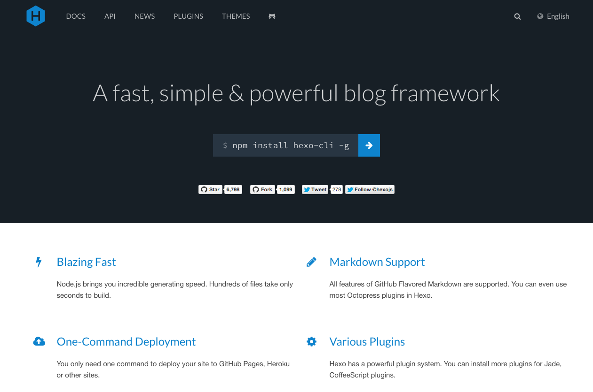
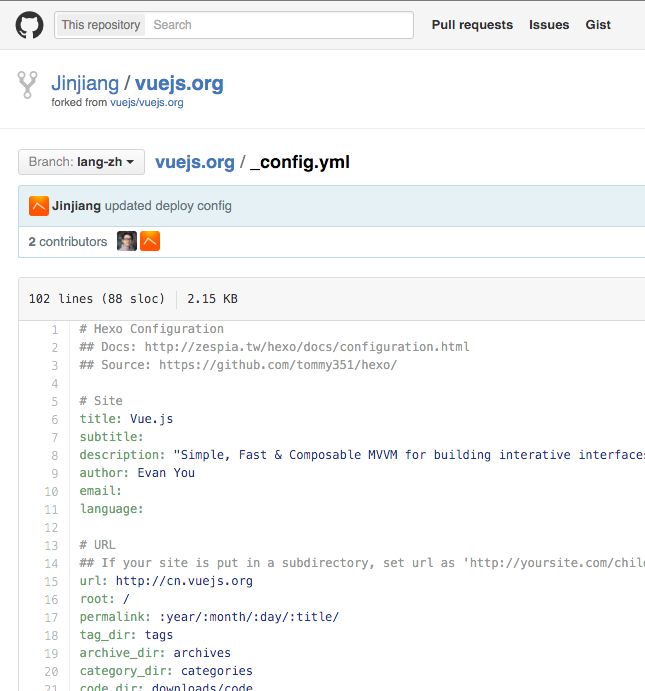

# 故事

----

### 故事

从一次持续集成 (ci) 的尝试开始

----

### 故事

- 一个前端工程
- 已经有了自动化语法和编码规范检查
- 已经有了自动化测试

----

### 故事

第一次试用公司某个新的持续集成平台

----

### 故事

入门文档是这样写的：

1. 在项目仓库里加入 ci 的钩子，保证每次推送代码都会触发 ci
2. 为项目撰写 ci 配置文件

----

### 故事

`*.yml` 配置文件

----

### yml 配置文件

大致需要配置的信息包括：

- stage: node-4、node-0.12……
- step: 环境准备、静态检查、单元测试、打包、安装、启动、集成测试……
- label: exec

----

### yml 配置文件

对 YAML 文件格式一直比较陌生……

----

### yml 配置文件

本来打算照猫画虎随便弄一下

----

### yml 配置文件

结果反复试来试去不成功  
(事后发现是样例找错了 - -)

----

### yml 配置文件

于是我又联想到了之前的一些经历……

----

### yml 配置文件

----

### yml 配置文件

----

### yml 配置文件

----

### yml 配置文件

----

### yml 配置文件

还有很多地方见到过 `*.yml`

----

### yml 配置文件

今后一定还会不断见到它，如果每次遇到还是仅仅模仿一下，一定还会遇到更多问题

----

### yml 配置文件

所以决定认真学习一下 YAML

[http://yaml.org](http://yaml.org)

