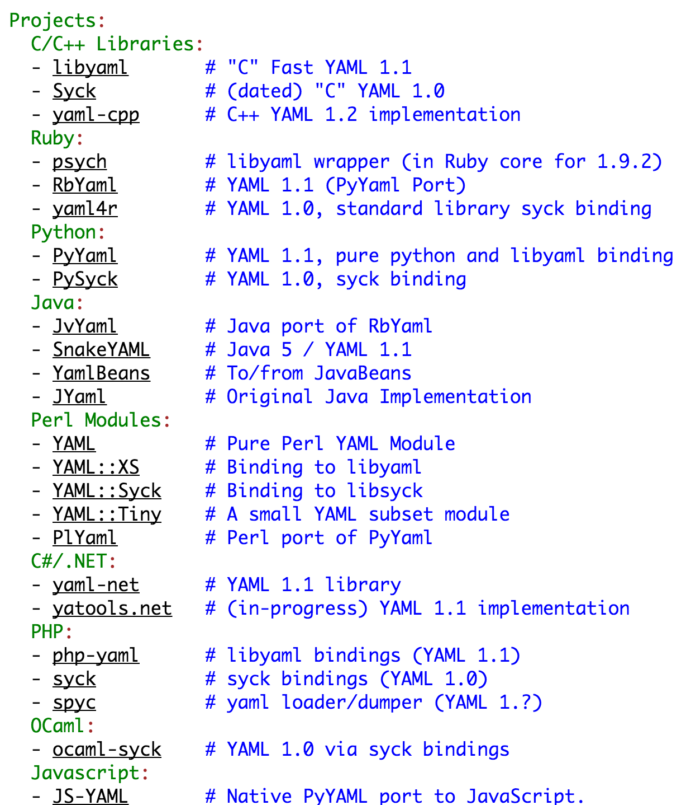
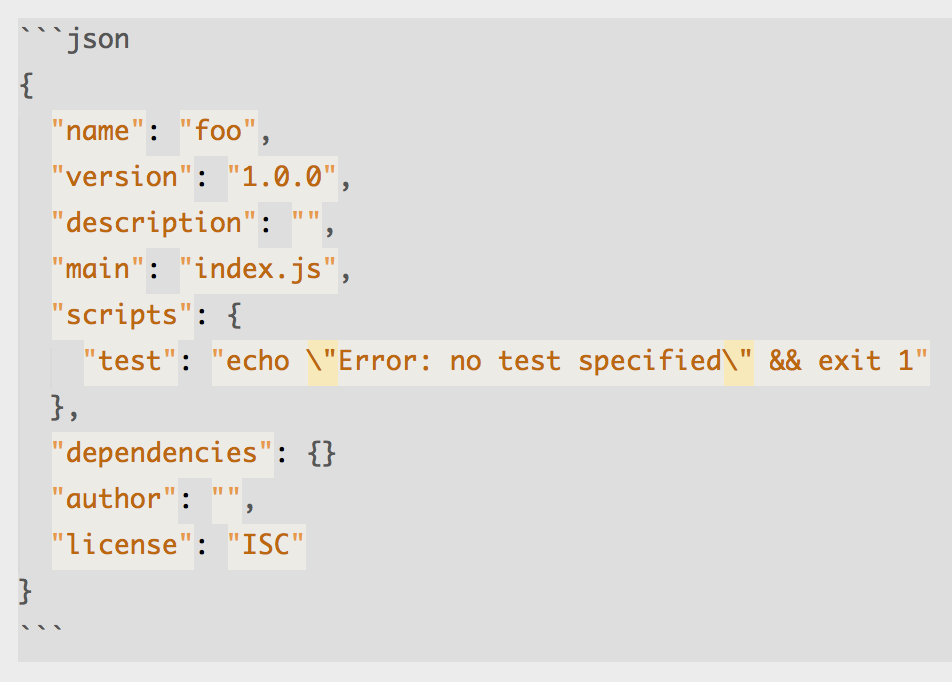
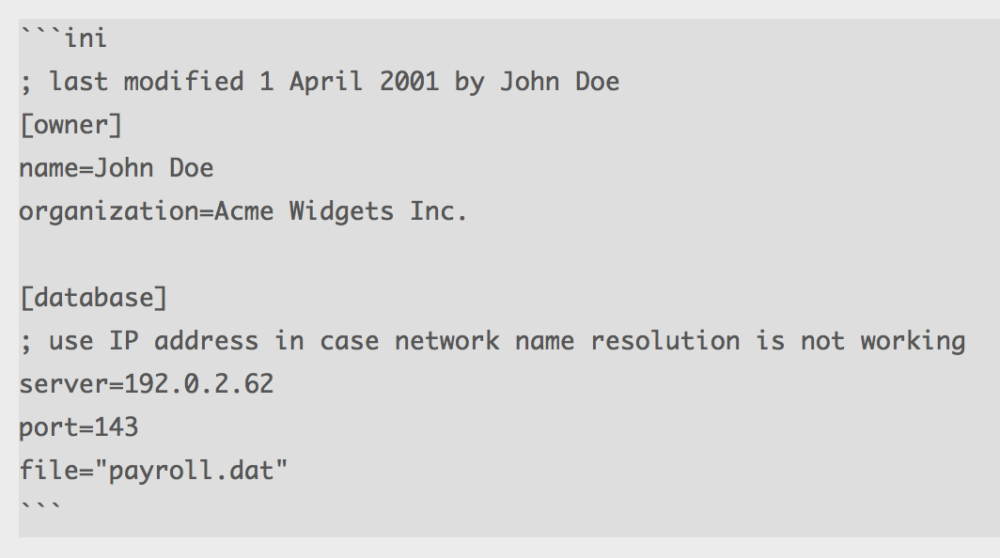
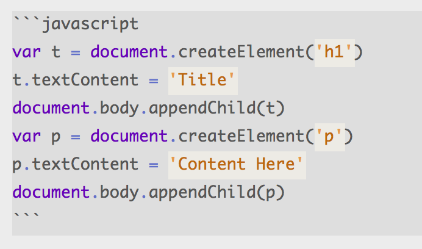
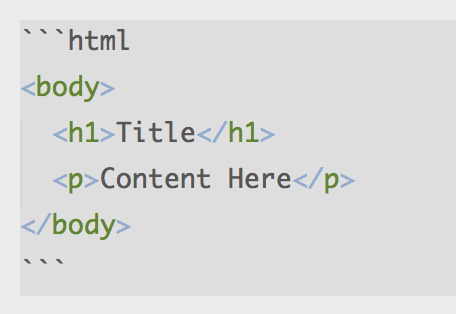
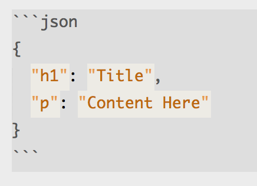
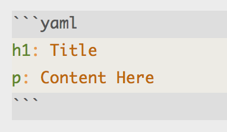

# What?

----

让计算机世界中的数据尽量可以被人类直观的阅读理解

----

什么样的数据可以同时被人类和计算机阅读理解呢？

----

- 前提，能够被计算机解析
- 首先，数据应该是文本的
- 其次，这段文本是能够描述出结构化信息的

----

YAML 以文本作为数据载体，能够表述一定的数据结构，拥有基于多种语言的解析器和工具，是一种典型并且应用广泛的“human readable data”

----

----

human readable data 适用于人工阅读和维护的程序配置信息，简单、直观、可被程序识别

----

JSON 也是这样的

- Node.js 中的 `package.json`
- Bower 中的 `bower.json`
- ...

----

----

还有一些类似的数据格式，比如 `ini` 文件  
[Wikipedia](https://en.wikipedia.org/wiki/INI_file)

----

----

当然，还有 `xml` 文件，这里不多做介绍

----

我们大前端已经有 HTML 和 JSON 了！为什么还需要 YAML？

----

### 大背景

因为前端的技术在发展  
不同的语言和技术之间在融合

----

### 人类可读性

总体上出现的特殊字符越少，结构越直观，可读性越强，也越适合人类书写，JSON/XML 并不占优势

----

### 程序可读性

JSON 在 JavaScript 中不需要另行解析，但在其它语言中也并没有优势
----

### 结构性

XML 的结构设计相对复杂一些，配套的设施积累比较多，语法更加严谨，适用于较为复杂的场景

----

随着前端的发展，我们会越来越多的和 YAML 数据打交道，同时也希望大家能够从“human readable data”的角度理解它的意义和价值

----

把 human readable 的理念运用在更多的地方

----

声明式 vs 命令式

----

----

----

更少的代码

----

----

更少的特殊字符

----

----

你还想到了哪些东西？

----

coffee / sass / jade / mustache / ...
