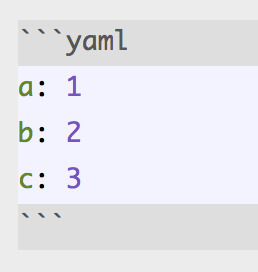
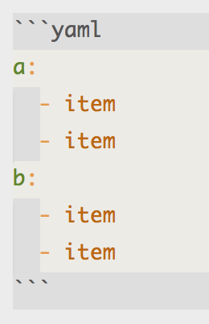
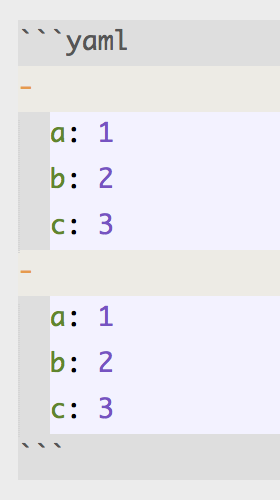
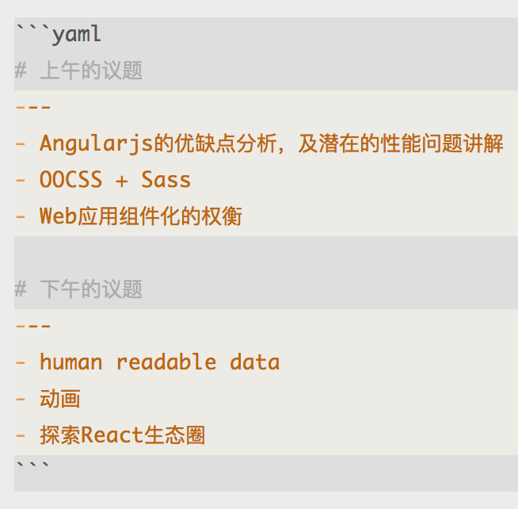
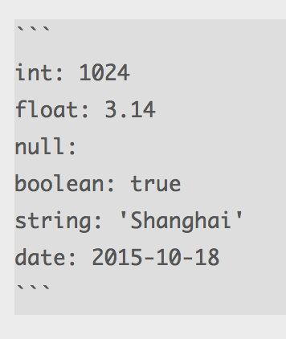
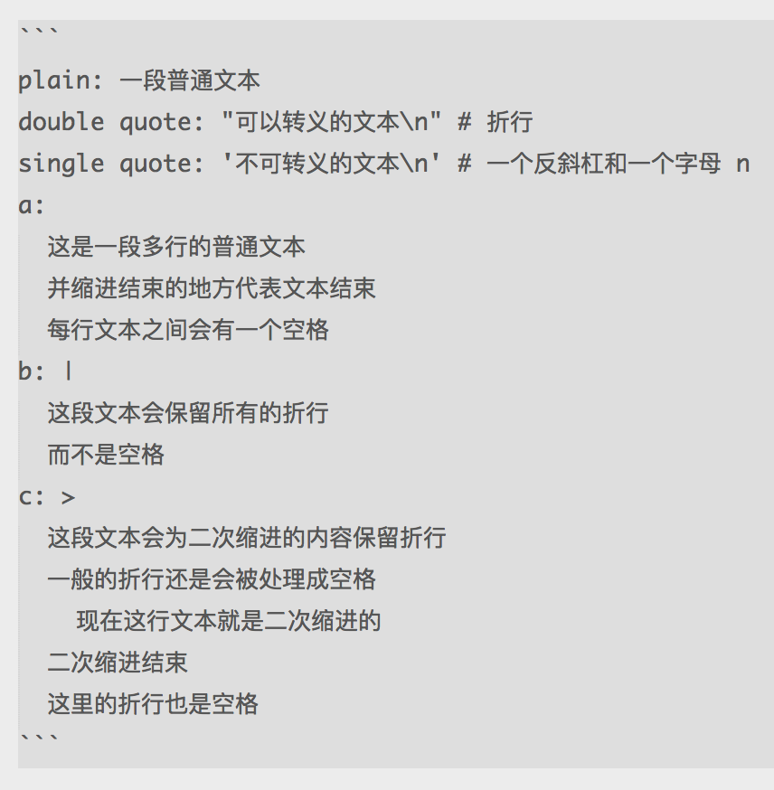
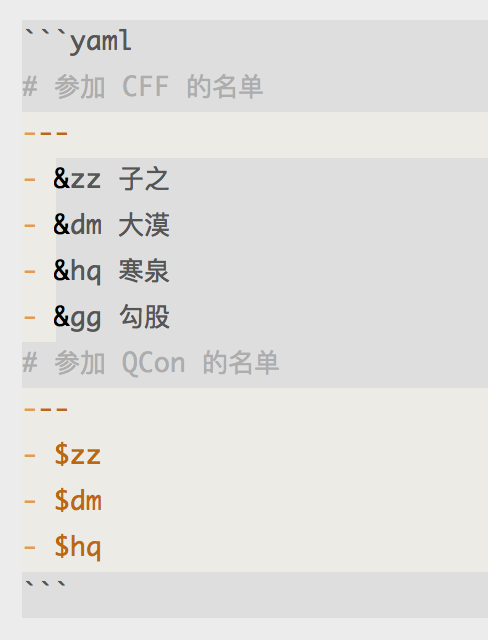

# YAML

----

### 序列表和映射表

----

### 序列表和映射表

----

### 每行一条且支持缩进

----

### 每行一条且支持缩进

----

`#` 代表注释

----

### `---` 代表段落分隔

----

### 数据格式

----

### 多种字符串的表达方式

----

### 重复的内容 `&` 和 `$`

----

### 更多

[http://yaml.org](http://www.yaml.org/spec/1.2/spec.html)  
[在线试用](http://nodeca.github.io/js-yaml/)
